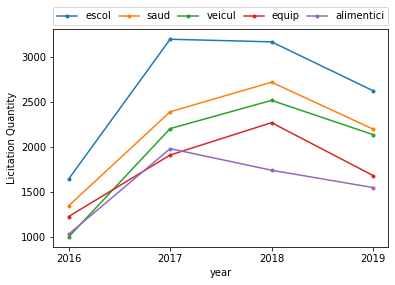
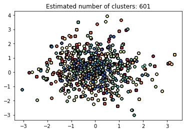
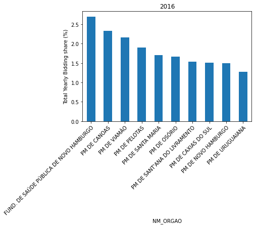
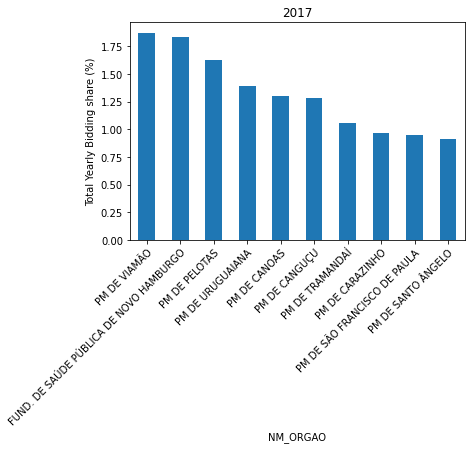
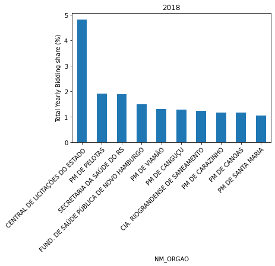
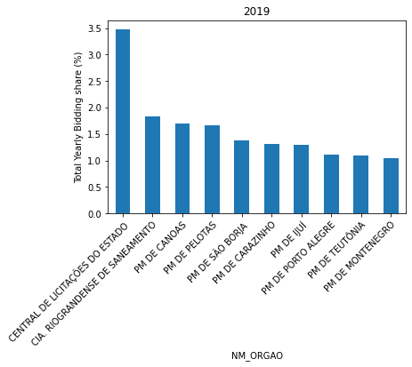
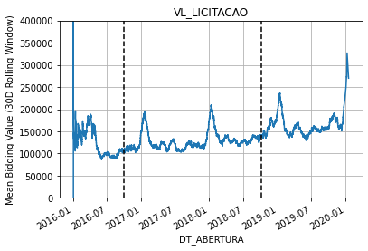
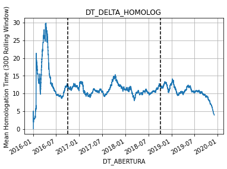

# Desafio Data Science Brigade
-------

## Introdução

Para este desafio, foquei principalmente em análises do arquivo licitação.txt,
onde procurei encontrar padrões e gráficos que fossem capazes de contar alguma 
história relevante.

## Quais os principais bens materiais comprados pelos órgãos públicos do Rio Grande do Sul?
-----
Como é possível ver nas imagens abaixo, os principais bens materiais são bens relativos à escolas
e saúde, além de bens relativos à veículos, equipamentos (que podem ser de várias áreas diferentes) e bens alimentícios.

No geral esse padrão se mantém em todos os anos que compreendem o escopo desse desafio.

## Análises

Diversas hipóteses e análises foram testadas, a 
análise principal do projeto envolve o processamento 
do texto do campo DS_OBJETO, aplicando técnicas clássicas como tokenização, remoção de _stopwords_, pontuação, etc.

-----

Para complementar a análise textual, foi feito um clusterizador baseado em [DBSCAN](https://en.wikipedia.org/wiki/DBSCAN) e em um modelo [Word2Vec](https://en.wikipedia.org/wiki/Word2vec) treinado em cima do corpo de texto considerando cada entrada do campo DS_OBJETO como um documento.

Infelizmente, acredito que devido ao formato do 
conjunto de dados utilizados e a 
falta de tempo para fazer uma varredura de 
hiper-parâmetros e algoritmos de clusterização como 
K-Means, Brown clustering, além de algoritmos de 
_embedding_ como N-Gram, Bag-Of-Words, etc.

O modelo do Word2Vec foi o escolhido pois ele 
possui uma forte capacidade de mapeamento devido
a sua base em redes neurais e é capaz de relacionar 
palavras utilizando informação de outras palavras 
próximas. O revés é que ele necessita de um corpo 
textual grande. Após treinar o modelo e tentar 
clusterizar os vetores de peso, foi _plotado_ um gráfico das duas primeiras dimensões do espaço vetorial, que infelizmente não ilustram uma separação bem definida.

Infelizmente não foi possível calcular o score da 
silhueta do objeto devido ao alto custo de tempo da 
operação. Mais métricas como dispersão inter-cluster e 
intra-cluster também não foram levadas em consideração 
devido ao tempo e escopo do desafio.

Algumas coisas interessantes como a distribuição das 
licitações por órgão público por ano (imagens abaixo) 
mostra uma certa não-uniformidade, especialmente com o 
aparecimento da Central de Licitações do Estado.

  

  

Além disso, uma análise temporal mostra uma forte 
sazonalidade (que não foi investigada além do que está 
ilustrado abaixo). Onde é possível ver que o início do 
ano normalmente é quando as coisas acontecem, 
esfriando as atividades. Também aparenta não ter uma 
relação forte com as datas da eleição.

O atraso entre homologação e abertura de uma licitação (DT_DELTA_HOMOLOG) também apresenta um comportamento cíclico.

NOTA: O gráfico acima está em escala de **dias**

## Melhorias futuras

Eu gostaria de abrir este espaço para indicar melhorias que poderiam ser feitas com relação ao código entregue, sendo elas:

- Um estudo mais aprofundado focando na tabela _item.txt_ primeiramente mimetizando o que foi feito para a coluna DS_OBJETO e aplicar as mesmas técnicas de processamento de texto para o campo DS_ITEM.
    - Também tentar clusterizar para verificar itens que são parecidos e ajudar na análise de compras.
- Dockerização e isolamento de ambiente do projeto (não foi feito por questões de tempo e simplicidade)
- Analisar mais a fundo licitações vazias e com uma disparidade alta entre o valor estimado inicialmente e o valor homologado.
- Descobrir se existe algum padrão entre a lentidão ou rapidez da aprovação de uma licitação baseado no órgão ou objeto de compra.